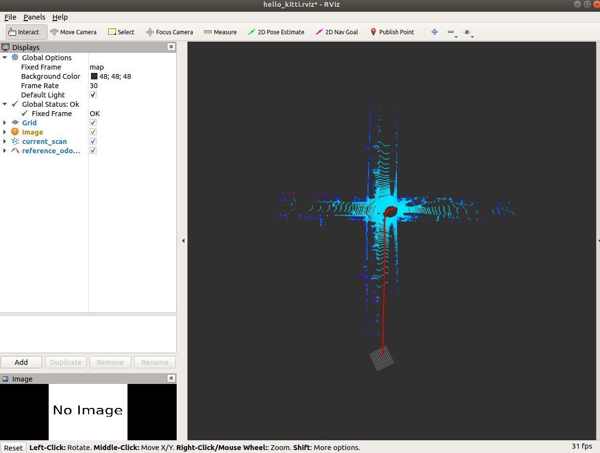

# 多传感器融合定位 第一章   概述  

本记录深蓝学院多传感器定位融合第四期学习笔记，官方推荐使用docker进行开发，为了方便之后移植部署，故本次在次在本地环境进行开发。

## 环境安装

#### 1. Ubuntu 18.04

 * 包括VScode VIM cmake 等常用工具

#### 2. Ros Melodic

 * rosdep init 及 rosdep update 不成功的 可参考网址

 * https://blog.csdn.net/leida_wt/article/details/115120940?utm_source=app&app_version=4.5.8

   

#### . g2o

```shell
// 从github上下载源码
$ https://github.com/RainerKuemmerle/g2o/tree/20170730_git

// 安装依赖
$ sudo apt-get install cmake libeigen3-dev libsuitesparse-dev qtdeclarative5-dev qt5-qmake libqglviewer-dev


// 编译
$ cd g2o
$ mkdir build
$ cd build
$ sudo ldconfig
$ cmake ..
$ make -j4

//安装
$ sudo make install
```

**注：** 一定要在编译前进入build，进行sudo ldconfig


#### 4. Ceres

```shell
// 需要自己下载源码
下载地址： https://github.com/ceres-solver/ceres-solver/releases

// 修改 sources.list
$ sudo gedit /etc/apt/sources.list
// 将此地址添加到source.list上
$ deb http://cz.archive.ubuntu.com/ubuntu trusty main universe 

// 更新源
$ sudo apt-get update

// 安装依赖
$ sudo apt-get install liblapack-dev libsuitesparse-dev libcxsparse3 libgflags-dev libgoogle-glog-dev libgtest-dev

// 解压并进入文件夹
$ cd ceres-solver-1.14.0

// 编译及安装
$ mkdir build
$ cd build
$ cmake ..
$ make -j4
$ sudo make install
```


#### 5. Geographic

```shell
// 需要自己下载源码
下载地址： https://sourceforge.net/projects/geographiclib/

// 解压并进入文件夹
$ cd GeographicLib-1.52

// 编译及安装
$ mkdir build
$ cd build
$ cmake ..
$ make -j4
$ sudo make install
```


#### 6. gflags

```shell
// 克隆源码
$ git clone https://github.com/gflags/gflags

// 解压并进入文件夹
$ cd gflags

// 编译及安装
$ mkdir build
$ cd build
$ cmake ..
$ make -j4
$ sudo make install
```


#### 7. glog

```shell
// 克隆源码
$ git clone https://github.com/boboxxd/glog.git

// 解压并进入文件夹
$ cd glog

// 安装依赖
$ sudo apt-get install autoconf automake libtool

// 配置
$ ./autogen.sh
$ ./configure

// 编译及安装
$ mkdir build
$ cd build
$ cmake ..
$ make -j4
$ sudo make install
```

注意： 出现如下问题时，是glog缺少gflag的依赖

```bash
logging.cc:(.text+0x6961)：对‘google::FlagRegisterer::FlagRegisterer<bool>(char const*, char const*, char const*, bool*, bool*)’未定义的引用
```

解决办法： 打开glog.cmake , 末尾改为

```bash
list(APPEND ALL_TARGET_LIBRARIES ${GLOG_LIBRARIES} libgflags.a libglog.a)
```


#### 8. Sophus

```shell
// 克隆源码
$ git clone https://github.com/strasdat/Sophus.git

// 解压并进入文件夹
$ cd Sophus
$ git checkout a621ff

// 编译及安装
$ mkdir build
$ cd build
$ cmake ..
$ make -j4
$ sudo make install
```

注: make编译时如果有报错，如下图:


解决方式如下:

```
$ cd Sophus/sophus/
$ sudo geidt so2.cpp
```


#### 9. GTSAM

```
// 克隆源码&自行下载
$ https://github.com/borglab/gtsam/archive/4.0.2.zip

// 解压并进入文件夹
$ unzip gtsam-4.0.2.zip
$ cd gtsam-4.0.2

// 编译及安装
$ mkdir build
$ cd build
$ cmake -DGTSAM_BUILD_WITH_MARCH_NATIVE=OFF ..
$ sudo make install
```


#### 10. Protobuf

```bash
// 克隆源码&自行下载 - V3.13
$ https://github.com/protocolbuffers/protobuf/tree/3.13.x

// 解压并进入文件夹
$ unzip protobuf-3.13.x.zip
$ cd protobuf-3.13.x

// 编译及安装
$ ./autogen.sh
$ ./configure
$ make
$ sudo make install
```

## 代码编译、运行

#### 1.编译 

lidar_localization  拷贝到catkin_ws 中，进行 catkin_make -j8 编译

#### 2.数据集下载

```
数据集百度网盘链接：
链接：https://pan.baidu.com/s/1gpO2Ssa12GoQTbYAseSFNA
提取码：cau9
```

```
微云文件分享:kitti_lidar_only_2011_10_03_drive_0027_synced.zip
下载地址:https://share.weiyun.com/QacEDADm
文件大小:4.8G
```


#### 3.运行代码,播放数据集

```bash
roslaunch lidar_localization hello_kitti.launch
```

```bash
rosbag  play kitti_lidar_only_2011_10_03_drive_0027_synced.bag
```


